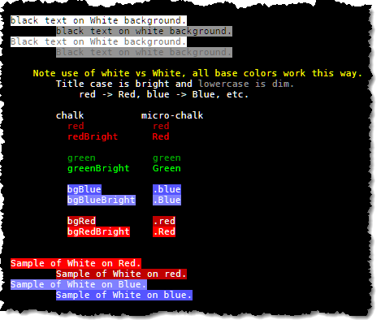
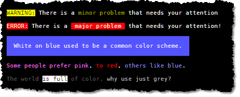

# micro-chalk
MicroChalk is a simple library for coloring terminal output with ansi codes.


#### Project Aims

* To be smaller
* More flexible
* With no dependencies
* Slightly more opinionated.

Most existing ``` chalk `template tag` ``` strings should work out of the box, please report if you find a discrepancy.

---
### Quick Example

<table style="border-width: 0px; border-color: transparent;"  border="0" cellspacing="0" cellpadding="0">
    <tr>
<td>

```js
const log = require('micro-chalk');

let str = log`
{red The color red is nice.}
{green green is nice too!}

{Red Is this a better red?}
{Green Is this a better green?}
`;

console.log(str);
```

</td>
<td valign="top">


</td>
</tr>
</table>

### Features
  * Simple Foreground/Background/Formatting
  * Allows Nested Styles
  * Allows Nested [Template Literals](https://developer.mozilla.org/en/docs/Web/JavaScript/Reference/Template_literals)
  * Aliases / Nested Aliases
  * pre/post Hooks

### Examples

#### Foreground/Background/Formatting
Unlike chalk, the first color to be referenced is assumed to be the foreground color while the second is assumed to be the background color.  This lets us have the same color names for little extra effort.

```js
const log = require('micro-chalk');

let str = log`
{black.White black text on White background.}
        {black.white black text on white background.}
{Black.White Black text on White background.}
        {Black.white Black text on white background.}

    {Yellow Note the case difference of white vs White, all colors are this way.}
        {white Lowercase is dim} and {White Title case is bright.}
            red -> Red, blue -> Blue, etc.
        
        chalk          micro-chalk
          {red red}            {red red}
          {redBright redBright}      {Red Red}
    	 
          {green green}          {green green}
          {greenBright greenBright}    {Green Green}
          
          {bgBlue bgBlue}         {.blue .blue}
          {bgBlueBright bgBlueBright}   {.Blue .Blue}

          {bgRed bgRed}          {.red .red}
          {bgRedBright bgRedBright}    {.Red .Red}


{White.Red Sample of White on Red.}
        {White.red Sample of White on red.}
{White.Blue Sample of White on Blue.}
        {White.blue Sample of White on blue.}
`;

console.log(str);
```



#### pre/post options

```js
const log = require('micro-chalk')
    .options( {
        pre: (input) => {
            // Do something with pre-processed input, perhaps translation, loading strings, whatnot.
            return input;
        },
        post: (output) => {
            // Do something with the output, such as sending it to console.log()
            console.log(output);
            return output;
        }
    } );

log`{Magenta There are many colors available}`;
```


#### Nested Styles
Nesting styles lets you encapsulate styles within one another; when an inner section closes, the fg/bg color states are restored to the containing block.

```js
const log = require('micro-chalk')
    .options( { post: (output) => { console.log(output); return output; } } );

log`{Magenta There are {Red many colors} {Blue available} for use, {Yellow 256 to be} exact.}`;
```


#### Nested Template Literals
You can nest template literals as deep as you like, each literal will be evaluated and the results may contain further marked sections.  Some sophisticated and pedantic examples are shown below.

```js
const log = require('micro-chalk')
    .options( { post: (output) => { console.log(output); return output; } } );

function check(value) {
    if(value >= .98)
        return `{Green ${value * 100}%}`;
    if(value >= .70)
        return `{black.Yellow ${value * 100}%}`;
    return `{White.Red ${value * 100}%}`;
}

log`
   Battery: ${check(.99)}
  CPU Load: ${check(.78)}   ${'{Yellow Warning}'}
Disk Space: ${check(.31)}   ${'{Red Danger {White.Red  Very Low } Disk Space}'}
`;
```


#### Aliasing
Aliasing lets you define aliases for common usage scenarios or define names for those 256 colors at your fingertips.

```js
const log = require('micro-chalk')
    .options( {
        aliases: {
            // Regular alias to colors 207, 239, 249
            pink:    207,
            grey39:  239,
            grey49:  249,

            // Alias of other aliases
            RED:    'Red',
            BLU:    'Blue',

            // Full Alias
            '^':    'black.Yellow',     // Black on Yellow
            '^^':   'White.Red',        // White on Red
            '#':    'White.blue',       // White on blue
            '=':    'White.black',      // White on black
        },
        post: (output) => { console.log(output); return output; }
    } );

log`
{^ WARNING:{=  There is a {yellow minor problem} that needs your attention.}}

{^^ ERROR:{=  There is a {^^  major problem } that needs your attention!}}

{#

  White on blue used to be a common color scheme.

}

{pink Some people prefer pink}, {RED to red}, {BLU others like blue}.

{grey39 The world {black.White is full} of color, {grey49 why use just grey?}}
`;
```


### Notes
  * micro-chalk assumes your output is ansi 256 color compliant
