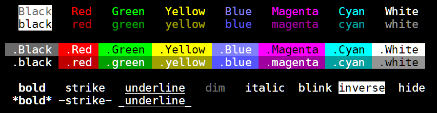
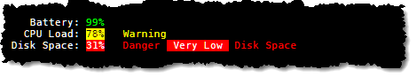
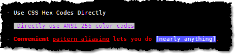

# micro-chalk
MicroChalk is a simple library for coloring terminal output with ansi codes.



#### Project Aims

* Be smaller & more flexible than other libraries with no dependencies
* Slightly more opinionated.

Most existing ``` chalk `template tag` ``` strings should work out of the box, please report if you find a discrepancy.

---
### Quick Example

```js
const log = require('micro-chalk');

let str = log`
{red There are *eight base colors* which come in _two shades_.}
{Green Green is bright, while {green green is dimmer than} {Green Green}}
`;

console.log(str);
```


### Features
  * Simple Foreground/Background/Formatting
  * Nested Styles
  * Nested [Template Literals](https://developer.mozilla.org/en/docs/Web/JavaScript/Reference/Template_literals)
  * Custom Aliases
  * Custom pre/post Hooks
  * Pattern Aliasing (\***bold**\*, _\_italic\__ or `add your own`)
  * Direct use of `256-color` codes and 24bit color via `#F00/#10FF10`
  * Base `Parser` is extensible for other markup uses

### Examples

#### Foreground/Background/Formatting
With micro-chalk, the first color used is taken as the foreground color while the second is the background color.  This lets us have the same color names for little extra effort.

In cases where only the background color is needed, simply use `.Red` as an example.

```js
const log = require('micro-chalk');

let str = log`
{black.White black text on White background.}
        {black.white black text on white background.}
{Black.White Black text on White background.}
        {Black.white Black text on white background.}

    {Yellow Note use of white vs White, all base colors work this way.}
        {White Title case is bright} and {white lowercase is dim.} 
            red -> Red, blue -> Blue, etc.
        
        chalk          micro-chalk
          {red red}            {red red}
          {redBright redBright}      {Red Red}
    	 
          {green green}          {green green}
          {greenBright greenBright}    {Green Green}
          
          {bgBlue bgBlue}         {.blue .blue}
          {bgBlueBright bgBlueBright}   {.Blue .Blue}

          {bgRed bgRed}          {.red .red}
          {bgRedBright bgRedBright}    {.Red .Red}


{.Red Sample of White on Red.}
        {.red Sample of White on red.}
{.Blue Sample of White on Blue.}
        {.blue Sample of White on blue.}
`;

console.log(str);
```


#### pre/post options

```js
const log = require('micro-chalk')
    .options( {
        pre: (input) => {
            // Do something with pre-processed input, perhaps translation, loading strings, whatnot.
            return input;
        },
        post: (output) => {
            // Do something with the output, such as sending it to console.log()
            console.log(output);
            return output;
        }
    } );

log`
{White You can use the {red post hook} to cause the 
result to go *straight to the console.*}
`;
```


#### Nested Styles
Nesting styles lets you encapsulate styles within one another; when an inner section closes, the fg/bg color states are restored to the containing block.

```js
const log = require('micro-chalk')
    .options( { post: (output) => { console.log(output); return output; } } );

log`
{Magenta Most terminals {red support {green the basic} 16 colors},  
{cyan many terminals} {Yellow support 256 colors} {Blue and 24-bit color.}}
`;
```


#### Nested Template Literals
You can nest template literals as deep as you like, each literal will be evaluated and the results may contain further marked sections.  Some sophisticated and pedantic examples are shown below.

```js
const log = require('micro-chalk')
    .options( { post: (output) => { console.log(output); return output; } } );

function check(value) {
    if(value >= .98)
        return `{Green ${value * 100}%}`;
    if(value >= .70)
        return `{black.Yellow ${value * 100}%}`;
    return `{White.Red ${value * 100}%}`;
}

log`
   Battery: ${check(.99)}
  CPU Load: ${check(.78)}   ${'{Yellow Warning}'}
Disk Space: ${check(.31)}   ${'{Red Danger {White.Red  Very Low } Disk Space}'}
`;
```



#### Aliasing
Aliasing lets you define aliases for common usage scenarios or define names for those 256 colors at your fingertips.

```js
const log = require('micro-chalk')
    .options( {
        aliases: {
            // Regular alias to colors 207, 239, 249
            pink:    207,
            grey39:  239,
            grey49:  249,

            // Alias of other aliases
            RED:    'Red',
            BLU:    'Blue',

            // Full Alias
            '^':    'black.Yellow',     // Black on Yellow
            '^^':   'White.Red',        // White on Red
            '#':    'White.blue',       // White on blue
            '=':    'White.black',      // White on black
        },
        post: (output) => { console.log(output); return output; }
    } );

log`
{^ WARNING:{=  There is a {yellow minor problem} that needs your attention.}}

{^^ ERROR:{=  There is a {^^  major problem } that needs your attention!}}

{#

  White on blue used to be a common color scheme.

}

{pink Some people prefer pink}, {RED to red}, {BLU others like blue}.

{grey39 The world {black.White is full} of color, {grey49 why use just grey?}}
`;
```


#### Additional Features

```js
const log = require('micro-chalk')
	.options({
		patternAliases: Object.assign({}, log.patternAliases, {
			'(\\[[^\\]]+\\])' : 'White.blue'
		}),
		post:    (output) => { console.log(output); return output; }
	});

log`
- {#FFF.#0000FF Use CSS Hex Codes Directly}

- {124.251  Directly use ANSI 256 color codes}

- {Red *Convenient* _pattern aliasing_ lets you do [nearly anything].}
`;
```


### Notes
  * micro-chalk assumes your output is ansi 256 color compliant
